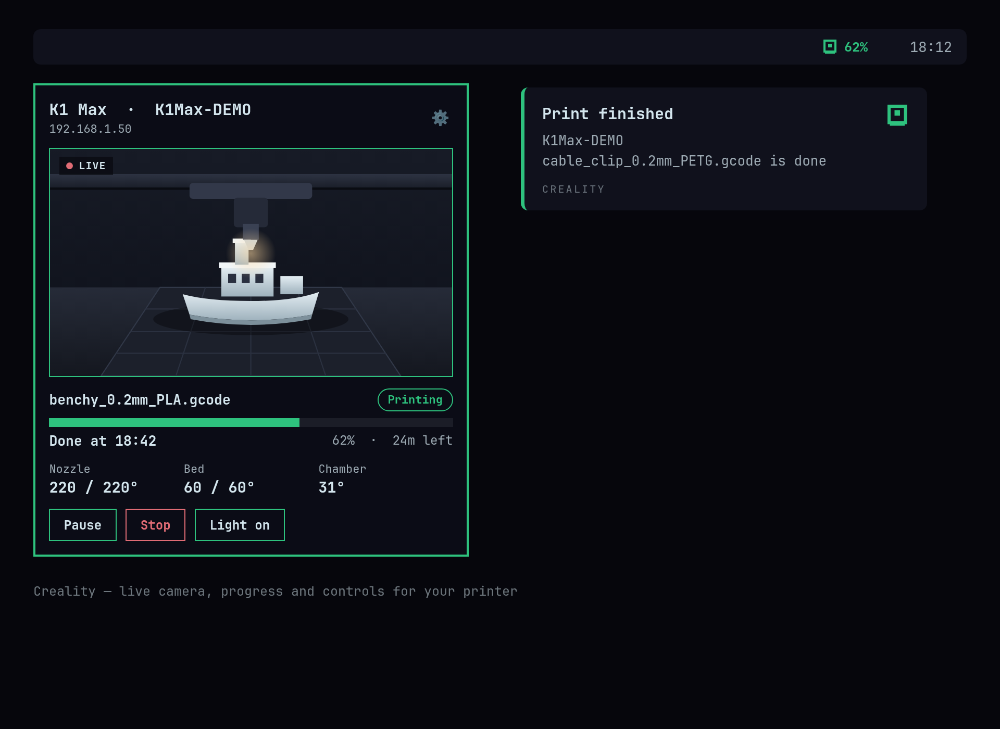

# Creality for Omarchy

An [Omarchy](https://omarchy.org/) bar widget for Creality 3D printers. A small printer mark sits in the bar: dimmed when idle, lit while the printer is calibrating or printing (with the percentage), and kept lit for a while after a print finishes. Click it for a panel with live camera video, state, progress with "Done at HH:MM", nozzle / bed / chamber temperatures, and Pause / Resume, Stop and Light controls. Inspired by [omarchy-bambu-lab](https://github.com/jankeesvw/omarchy-bambu-lab).



## What it does

- Finds your printer automatically on the local network. If exactly one is found it is selected for you; otherwise pick from a list or type an IP address.
- Live camera video in the panel (about 15 fps).
- States: Preparing (self-test and calibration), Starting, Printing, Paused, Stopping, Finished, Error. Pause and Stop are only offered while they work (printing or paused).
- Desktop notifications when a print finishes, pauses or fails.
- If the saved IP stops answering, the printer is re-discovered by hostname and the address is updated.

## Requirements

Required:

- Omarchy shell (Hyprland)
- `python3` (standard library only, no pip packages)
- `ip` from iproute2 (to find your subnet)

For the camera on WebRTC printers (K1 Max, K2 family, Hi and others reporting `webrtcSupport`):

- `go2rtc`: install it from the panel button described below, or run `yay -S go2rtc-bin`
- `ffmpeg`, `qt6-multimedia` and `qt6-multimedia-ffmpeg` (all three are preinstalled on Omarchy)

Optional:

- `notify-send` for desktop notifications

Printers with a plain MJPEG snapshot camera, and Moonraker webcams, need none of the camera packages.

## Install

```
omarchy plugin add <git-url> --enable
```

Or by hand:

```
git clone <git-url> ~/.config/omarchy/plugins/io.github.bbssyl.creality
omarchy-shell shell rescanPlugins
omarchy plugin enable io.github.bbssyl.creality right
omarchy restart shell
```

## Setup

Nothing to configure. On first start the plugin probes ports 9999 and 7125 on your local /24 and selects the printer it finds. If none or several are found, open the panel and use the setup view (the gear icon): choose a printer from the list, or enter an IP and pick the protocol (Creality OS or Moonraker).

Config lives in `~/.config/omarchy-creality/config.json`: `ip`, `protocol`, `model`, `hostname`, `finished_lit_minutes` (default 10), `notify` (default true). Optional: `ws_port`, `http_port`, `camera_port`, `light_macro`.

## Supported printers

- Creality OS WebSocket (port 9999): K1, K1C, K1 Max, K2 family, Hi, Ender-3 V3 KE. Verified on a real K1 Max.
- Moonraker (port 7125): rooted or Klipper-based Creality printers. The light toggle needs `light_macro` in the config.

## Camera

- **Snapshot cameras** (MJPEG at `http://IP:8080/?action=snapshot`, Moonraker webcams) are fetched directly while the panel is open.
- **WebRTC-only cameras** are bridged through [go2rtc](https://github.com/AlexxIT/go2rtc) using the source `webrtc:http://IP:8000/call/webrtc_local#format=creality`. The panel plays the stream live with QtMultimedia.

How the WebRTC bridge works:

- go2rtc is started on demand when you open the panel and stopped about 30 seconds after you close it. It also exits whenever the plugin's bridge exits.
- It listens on `127.0.0.1` only, on random ports. Its RTMP, WebRTC and SRTP listeners are disabled, so nothing is exposed to your network.
- The printer's stream carries broken RTP timestamps that make players show about one frame per second. go2rtc therefore runs an `ffmpeg -c copy` step (no re-encoding) that restamps frames by arrival time, which gives smooth 15 fps playback.

### Installing go2rtc from the panel

If a WebRTC camera is detected and go2rtc is missing, the camera area shows "Live camera needs go2rtc" and an **Install camera support** button. Clicking it opens a terminal running `omarchy pkg aur add go2rtc-bin`. You watch it happen and type your sudo password there yourself; the plugin never installs anything silently and never calls sudo, pacman or yay behind your back. While the terminal is open the panel shows "Installing camera support…". When it finishes the camera starts without restarting the shell.

On systems without Omarchy's terminal launcher the button is not shown; the panel tells you to run `yay -S go2rtc-bin` yourself.

## State mapping

Captured and verified on a real K1 Max job (start, calibration, print, pause, stop):

| Printer reports | Shown as |
|---|---|
| `state` 9 | Starting |
| `state` 1 with `withSelfTest` below 100 and `enableSelfTest` 1 | Preparing (calibrating) |
| `state` 1 with `withSelfTest` 100 | Printing |
| `state` 5 or `pause` 1 | Paused |
| `state` 7 | Stopping |
| `state` 4 | Idle (stopped) |
| a file name with `printProgress` 100 or more | Finished |
| non-zero `err.errcode` | Error |

Still community-sourced and not independently verified: the `lightSw` light toggle, the `heart_beat` reply (`ok`), and the `:8080` snapshot URL used by non-WebRTC models. The protocol was cross-checked against [ha_creality_ws](https://github.com/3dg1luk43/ha_creality_ws).

## Privacy and network

The plugin only talks to your printer on the local network and to go2rtc on localhost. At startup it probes ports 9999 and 7125 on your local /24 to find printers, and repeats that with growing delays (1 minute up to 30 minutes) only when a configured printer stops responding. There is no cloud service and no telemetry.

## Development

```
python3 test/mock_creality_ws.py --port 19999 --camera-port 18080
python3 test/mock_moonraker.py --port 17125
bin/creality-bridge --host 127.0.0.1 --protocol creality-ws --ws-port 19999 status
bin/creality-bridge watch --demo
python3 test/test_states.py
```

## Uninstall

```
omarchy plugin remove io.github.bbssyl.creality
```

Your settings in `~/.config/omarchy-creality/` and cached camera frames in `~/.cache/omarchy-creality/` are left in place; delete those folders to remove them too. go2rtc stays installed; remove it with `omarchy pkg drop go2rtc-bin` if you no longer want it.

## License

MIT. See [LICENSE](LICENSE).
